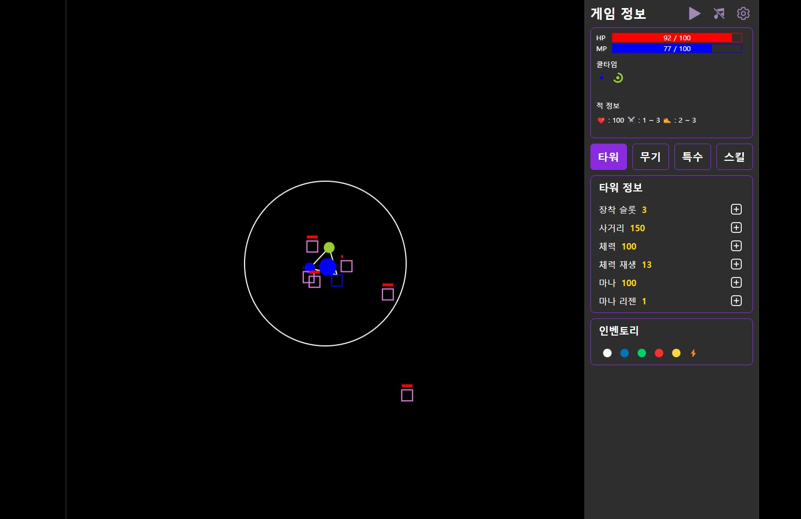

<h2>타워디펜스 <a href="https://pukkok.github.io/tower-defense">[게임하러가기]</a></h1> 

미사일을 장착하고 몰려오는 적을 물리치세요!

일시정지는 esc, 음소거는 m, 스킬단축키는 1번입니다.

    <h4>이모티콘 간단 설명</h4>
    
❤️ : 적의 체력

    
⚔️ : 적의 공격력

    
🥾 : 적의 속도

    
💢 : 적의 분노(스테이지)

<h2>게임 이미지</h2>

